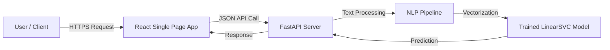

# Sentiment Analysis / Intelligence Platform
**Project Documentation & Workflow**

---

## 1. Executive Summary
This project is a high-performance, real-time Sentiment Intelligence Platform designed to analyze textual feedback and determine emotional tone (Positive, Negative, Neutral) with confidence scores. It leverages Machine Learning (LinearSVC) and Natural Language Processing (NLP) techniques, wrapped in a modern, production-ready web application.

The system is built with a **FastAPI** backend for high-concurrency inference and a **React (Vite)** frontend featuring a futuristic "Antigravity" glassmorphism UI.

---

## 2. System Architecture

### 2.1 High-Level Overview
The application follows a decoupled client-server architecture:



### 2.2 Technology Stack
| Component | Technology | Rationale |
| :--- | :--- | :--- |
| **Frontend** | React, Vite, TailwindCSS | Fast rendering, modern component system, rapid styling. |
| **Backend** | Python, FastAPI, Uvicorn | High performance (ASGI), native async support, easy ML integration. |
| **ML/NLP** | Scikit-learn, NLTK, Pandas | Standard industry tools for classical ML and text processing. |
| **Model** | LinearSVC (Support Vector Machine) | Chosen for high accuracy and speed on text classification tasks. |

---

## 3. Workflow & Data Pipeline

### 3.1 Machine Learning Pipeline
1.  **Data Ingestion**: Using NLTK Movie Reviews dataset (labeled positive/negative).
2.  **Preprocessing**:
    *   Lowercasing
    *   Punctuation Removal
    *   Stopword Removal (using NLTK corpus)
    *   Lemmatization (WordNetLemmatizer)
3.  **Feature Extraction**: TF-IDF (Term Frequency-Inverse Document Frequency) Vectorization.
4.  **Training**: Linear Support Vector Classification (LinearSVC) with pipeline architecture.
5.  **Serialization**: Model saved as `sentiment_model.pkl` using Joblib.

### 3.2 Application Flow
1.  **User Input**: User enters text in the Dashboard.
2.  **API Request**: Frontend sends `POST /api/predict` with JSON payload `{ "text": "..." }`.
3.  **Inference**:
    *   Backend loads the serialized model (singleton pattern).
    *   Input text is passed through the *same* preprocessing function used in training.
    *   Model predicts sentiment class and confidence score.
4.  **Visualization**: Frontend receives response and animates logical indicators (Confidence Bar, Emoji, Gradient Color).

---

## 4. API Specification

### Endpoint: `/api/predict`
*   **Method**: `POST`
*   **Description**: Analyzes the emotion of a single text string.
*   **Request Body**:
    ```json
    {
      "text": "The user interface is incredibly intuitive!"
    }
    ```
*   **Response**:
    ```json
    {
      "sentiment": "pos",
      "confidence": 0.98,
      "probabilities": { "score": 1.2 }
    }
    ```

---

## 5. Deployment & Setup

### 5.1 Prerequisites
*   Node.js (v18+)
*   Python (v3.9+)

### 5.2 Backend Setup
```bash
cd backend
python -m venv venv
source venv/bin/activate
pip install -r requirements.txt
uvicorn app.main:app --reload
```

### 5.3 Frontend Setup
```bash
cd frontend
npm install
npm run dev
```

---

## 6. Future Roadmap
*   **Deep Learning Integration**: Upgrade to BERT/RoBERTa for context-aware analysis.
*   **Database Integration**: Store history of analyses in PostgreSQL/MongoDB.
*   **User Authentication**: Multi-user support with private dashboards.

---
*@ shreyansh pratap mishra *
* All rights reserved. *
